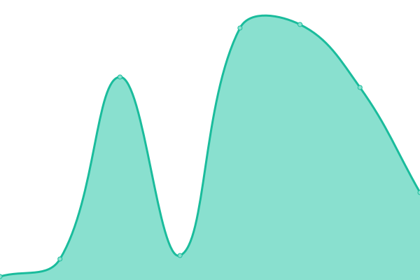

# [📈 Live Status](https://upptime.github.io/upptime): <!--live status--> **🟧 Partial outage**

This repository contains the open-source uptime monitor and status page for [Upptime](https://upptime.js.org), powered by [Upptime](https://github.com/upptime/upptime).

With [Upptime](https://upptime.js.org), you can get your own unlimited and free uptime monitor and status page, powered entirely by a GitHub repository. We use [Issues](https://github.com/upptime/upptime/issues) as incident reports, [Actions](https://github.com/marcoadasilvaa/health/actions) as uptime monitors, and [Pages](https://upptime.github.io/upptime) for the status page.

<!--start: status pages-->
<!-- This summary is generated by Upptime (https://github.com/upptime/upptime) -->
<!-- Do not edit this manually, your changes will be overwritten -->
<!-- prettier-ignore -->
| URL | Status | History | Response Time | Uptime |
| --- | ------ | ------- | ------------- | ------ |
|  [Api](https://app.sanna.pe/validacionServicios.html) | 🟥 Down | [api.yml](https://github.com/marcoadasilvaa/health/commits/HEAD/history/api.yml) | 

 446ms
     
 | 

<a href="https://marcoadasilvaa.github.io/health/history/api">0.00%</a>
    

|  [Web](https://www.sanna.pe/) | 🟩 Up | [web.yml](https://github.com/marcoadasilvaa/health/commits/HEAD/history/web.yml) | 

 487ms
     
 | 

<a href="https://marcoadasilvaa.github.io/health/history/web">60.05%</a>
    

|  [Doctor](https://doctoronline.doctormas.com.pe/) | 🟥 Down | [doctor.yml](https://github.com/marcoadasilvaa/health/commits/HEAD/history/doctor.yml) | 

 0ms
     
 | 

<a href="https://marcoadasilvaa.github.io/health/history/doctor">0.00%</a>
    

|  [Web Patient](https://www.sanna.pe/citas/) | 🟩 Up | [web-patient.yml](https://github.com/marcoadasilvaa/health/commits/HEAD/history/web-patient.yml) | 

 109ms
     
 | 

<a href="https://marcoadasilvaa.github.io/health/history/web-patient">61.09%</a>
    

|  [Video](https://jitsi.sannavideos.com/) | 🟩 Up | [video.yml](https://github.com/marcoadasilvaa/health/commits/HEAD/history/video.yml) | 

 188ms
     
 | 

<a href="https://marcoadasilvaa.github.io/health/history/video">100.00%</a>
    

|  [Video Call](https://jitsi.sannavideos.com/test) | 🟩 Up | [video-call.yml](https://github.com/marcoadasilvaa/health/commits/HEAD/history/video-call.yml) | 

 61ms
     
 | 

<a href="https://marcoadasilvaa.github.io/health/history/video-call">100.00%</a>
    

|  [Video 01](https://jitsi01.sannavideos.com/) | 🟩 Up | [video-01.yml](https://github.com/marcoadasilvaa/health/commits/HEAD/history/video-01.yml) | 

 186ms
     
 | 

<a href="https://marcoadasilvaa.github.io/health/history/video-01">100.00%</a>
    

|  [Video Call 01](https://jitsi01.sannavideos.com/test) | 🟩 Up | [video-call-01.yml](https://github.com/marcoadasilvaa/health/commits/HEAD/history/video-call-01.yml) | 

 60ms
     
 | 

<a href="https://marcoadasilvaa.github.io/health/history/video-call-01">100.00%</a>
    

|  [Admin](https://admin.tutenlabs.com/) | 🟩 Up | [admin.yml](https://github.com/marcoadasilvaa/health/commits/HEAD/history/admin.yml) | 

 130ms
     
 | 

<a href="https://marcoadasilvaa.github.io/health/history/admin">100.00%</a>
    

|  [Admin (OLD)](https://admfsm.tutenlabs.com/) | 🟩 Up | [admin-old.yml](https://github.com/marcoadasilvaa/health/commits/HEAD/history/admin-old.yml) | 

 128ms
     
 | 

<a href="https://marcoadasilvaa.github.io/health/history/admin-old">100.00%</a>
    

|  [Api Mobile (OLD)](https://api-mobile.tutenservicios.com/) | 🟩 Up | [api-mobile-old.yml](https://github.com/marcoadasilvaa/health/commits/HEAD/history/api-mobile-old.yml) | 

 210ms
     
 | 

<a href="https://marcoadasilvaa.github.io/health/history/api-mobile-old">100.00%</a>
    

|  [S2](https://servi2.tuten.cl/) | 🟩 Up | [s2.yml](https://github.com/marcoadasilvaa/health/commits/HEAD/history/s2.yml) | 

 253ms
     
 | 

<a href="https://marcoadasilvaa.github.io/health/history/s2">100.00%</a>
    

|  [S2 - Api](https://servi2.tuten.cl/TutenREST/) | 🟩 Up | [s2-api.yml](https://github.com/marcoadasilvaa/health/commits/HEAD/history/s2-api.yml) | 

 22ms
     
 | 

<a href="https://marcoadasilvaa.github.io/health/history/s2-api">100.00%</a>
    

|  [FX](https://fenix.tuten.cl/) | 🟩 Up | [fx.yml](https://github.com/marcoadasilvaa/health/commits/HEAD/history/fx.yml) | 

 183ms
     
 | 

<a href="https://marcoadasilvaa.github.io/health/history/fx">100.00%</a>
    

|  [FX - Api](https://fenix.tuten.cl/TutenREST/) | 🟩 Up | [fx-api.yml](https://github.com/marcoadasilvaa/health/commits/HEAD/history/fx-api.yml) | 

 23ms
     
 | 

<a href="https://marcoadasilvaa.github.io/health/history/fx-api">100.00%</a>
    

<!--end: status pages-->

[**Visit our status website →**](https://upptime.github.io/upptime)

## 📄 License

- Powered by: [Upptime](https://github.com/upptime/upptime)
- Code: [MIT](./LICENSE) © [Upptime](https://upptime.js.org)
- Data in the `./history` directory: [Open Database License](https://opendatacommons.org/licenses/odbl/1-0/)
